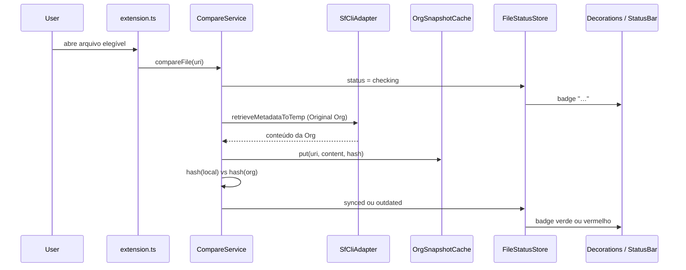

# Salesforce Compare — Arquitetura e guia para o time

Documento interno para quem for continuar o desenvolvimento da extensão **Salesforce Compare** (`LeftConsult.salesforce-compare`).

Versão documentada: **1.1.0**. Código-fonte em TypeScript em `src/`. Ponto de entrada: `src/extension.ts`.

---

## 1. O que é esta extensão

Extensão para **VS Code** e **Cursor** que compara arquivos-fonte de um projeto Salesforce DX **locais** com o conteúdo da Org autenticada.

Comportamento central:

- Ao abrir um arquivo elegível, a extensão faz **retrieve** da Org em background e compara com o conteúdo local.
- Mostra badges no Explorer / abas: verde (igual), vermelho (diferente), `…` (comparando), `!` (erro).
- Status bar: `SF Equal` / `SF Different` / `SF Comparing…` / `SF Error`.
- Diff estilo Git (lado a lado): **Local à esquerda**, Org à direita — Original Org ou Org de comparação.
- **Nunca faz deploy.** Só retrieve, cache, hash e UI.
- Se o metadata **não existir** na Org de comparação (Diff with Other Org), o lado direito fica **vazio** (não reutiliza o seed local).

Marketplace:

- VS Code: `LeftConsult.salesforce-compare`
- Cursor (Open VSX): `LeftConsult/salesforce-compare`

---

## 2. Princípios que não podem ser quebrados

Quem evoluir o código precisa preservar estes invariantes:

1. **Retrieve-only.** O único módulo que executa `sf` é `SfCliAdapter`. Ele não pode ganhar comandos de deploy/push.
2. **Original Org vs Comparison Org.** Badges, status bar e auto-check refletem **somente** Local ↔ Original Org. Orgs extras existem só para **Diff with Other Org**.
3. **Não poluir o projeto do usuário.** Snapshots da Org e arquivos temporários de comparação ficam no *global storage* da extensão, nunca em `force-app`.
4. **Não alterar o default da CLI.** O fluxo Authorize da extensão **nunca** passa `--set-default`. A Org padrão vem do Salesforce CLI / Extension Pack.
5. **Não cancelar compares ao trocar de arquivo.** A fila em `CompareService` permite jobs em paralelo; abrir outro arquivo enfileira, não aborta.
6. **Auth não abre wizard sozinho.** Falha de autenticação pinta a Org de vermelho na sidebar; o usuário reconecta manualmente.

---

## 3. Stack e ciclo de build

| Peça | Escolha |
|------|---------|
| Runtime | VS Code Extension API (`engines.vscode`: `^1.85.0`) |
| Linguagem | TypeScript 5.6, `strict`, CommonJS, target ES2022 |
| Bundle | **esbuild** (`esbuild.js`) → `dist/extension.js` |
| Empacote | `@vscode/vsce` → `.vsix` |
| Dependências de runtime | **Nenhuma.** Só `devDependencies`. `vscode` é `external` no bundle |

Scripts (`package.json`):

```bash
npm install
npm run watch      # esbuild em watch (desenvolvimento)
npm run compile    # tsc --noEmit (typecheck)
npm run build      # bundle de produção
npm run package    # gera o .vsix
```

Debug: **F5** usa `.vscode/launch.json` (`Run Salesforce Compare Extension`), que dispara `npm: build` e abre um Extension Development Host.

Ativação: `workspaceContains:**/sfdx-project.json`. A extensão **não** liga em workspaces que não são Salesforce DX.

---

## 4. Estrutura de pastas

```
src/
├── extension.ts                 # Composition root (activate / deactivate)
├── commands/                    # Handlers finos de comandos (UI + orquestração)
│   ├── diffWithOrg.ts
│   ├── diffWithOtherOrg.ts
│   ├── recheckFile.ts
│   └── showLastCheck.ts
├── services/                    # Regras de negócio (sem spawn de CLI)
│   ├── CompareService.ts        # Fila + retrieve + hash + status (Original)
│   ├── OrgResolver.ts           # Resolve a Original Org
│   ├── OrgConnectionService.ts  # Authorize / reconnect / comparison Orgs
│   ├── ConnectedOrgsStore.ts    # Persistência workspace das Orgs extras
│   ├── OrgAuthStatusStore.ts    # Saúde de auth (vermelho na sidebar)
│   ├── FileStatusStore.ts       # Status synced/outdated por arquivo
│   ├── ComparisonTempFileService.ts
│   └── DeployWatcher.ts         # Detecta deploy/retrieve externos
├── infrastructure/              # I/O (CLI, disco, hash)
│   ├── SfCliAdapter.ts          # ÚNICO lugar que chama `sf`
│   ├── OrgSnapshotCache.ts
│   └── ContentHashUtil.ts
├── providers/                   # VS Code providers (conteúdo virtual + decorações)
│   ├── OrgContentProvider.ts
│   ├── StatusDecorationProvider.ts
│   ├── ComparisonFileDecorationProvider.ts
│   └── OrgSidebarDecorationProvider.ts
├── ui/
│   ├── StatusBarController.ts
│   └── ConnectedOrgsTreeProvider.ts
└── util/
    ├── constants.ts             # IDs de comando, schemes, contextos
    ├── SalesforcePathMapper.ts  # Elegibilidade + raiz DX
    ├── authErrors.ts
    └── retrieveWithAuthRetry.ts

document/                        # Histórico de demandas (SALEXT-0001 …)
scripts/                         # Publicação Marketplace / Open VSX
images/                          # Ícone da loja + ícone da Activity Bar
```

Camadas (dependências apontam para baixo):

```
extension.ts (wiring)
    → commands / ui / providers
        → services
            → infrastructure / util
```

Não inverter isso: um `SfCliAdapter` não deve conhecer TreeView; um command não deve chamar `execFile` direto.

---

## 5. Composition root (`activate`)

Tudo nasce em `src/extension.ts`. Ordem importante:

1. Infra: `SfCliAdapter`, `OrgResolver`, `FileStatusStore`, `OrgSnapshotCache`.
2. Núcleo: `CompareService`, `OrgContentProvider`, `StatusDecorationProvider`, `StatusBarController`, `DeployWatcher`.
3. Multi-Org (SALEXT-0004): `ConnectedOrgsStore`, `OrgAuthStatusStore`, `OrgConnectionService`, sidebar, temp files, decorações extras.
4. Registrar providers, TreeView, comandos e listeners (`onDidOpen`, `onDidSave`, etc.).
5. `connectedOrgsTree.initialize()` **depois** de registrar o TreeDataProvider (primeiro paint correto).
6. Auto-check dos documentos já abertos.

`deactivate()` só limpa timers de sync externo.

Novos serviços: instanciar aqui, `push` em `context.subscriptions` se forem `Disposable`, e injetar nos commands. Não criar singletons globais.

---

## 6. Mapa dos módulos

### 6.1 Infrastructure

**`SfCliAdapter`** — único ponto que spawna processos:

| Método | CLI | Para quê |
|--------|-----|----------|
| `isCliAvailable` | `sf version --json` | Detectar `sf` no PATH |
| `getTargetOrg` | `sf config get target-org --json` | Fallback da Original Org |
| `retrieveMetadataToTemp` | `sf project retrieve start --source-dir … --ignore-conflicts --json` | Conteúdo da Org **sem** alterar o workspace |
| `listOrgs` | `sf org list --skip-connection-status --json` | Lista rápida (não pinga a Org) |
| `loginOrgWeb` | `sf org login web --alias --instance-url --json` | OAuth no browser |

Retrieve isolado (ideia-chave):

1. Cria pasta temp `sf-compare-proj-*`.
2. Copia só `sfdx-project.json` + o arquivo (e `-meta.xml` companheiro, se existir).
3. Roda retrieve com `--source-dir` relativo e `--ignore-conflicts` (sandbox/scratch não estouram `SourceConflictError`).
4. Lê o arquivo recuperado.
5. Apaga o temp project.

Windows: tenta `sf.cmd` com `shell: true`, depois `sf`. Erros de CLI são limpos (`formatCliFailure`) — banners de update e JSON `name`/`message`.

**`OrgSnapshotCache`** — snapshots em `globalStorage/org-snapshots`. Chave padrão = URI do arquivo (Original Org). Com `scopeByOrg: true`, chave = `uri::org=alias` (diffs de outras Orgs, sem sobrescrever o snapshot da Original).

**`ContentHashUtil`** — SHA-256 após normalizar BOM e CRLF → LF. Local vs Org não deve falhar só por quebra de linha.

### 6.2 Services

**`CompareService`** — orquestrador.

- Fila com concorrência `salesforceCompare.maxConcurrentCompares` (default 2).
- Mesmo URI compartilhado: vários waiters, um job (salvo `force: true`).
- `compareFile` → retrieve Original → cache → hash → `synced` / `outdated`.
- `ensureOrgContent` — snapshot fresco para Diff with Org (sem wizard inline).
- `ensureOrgContentForOrg` — retrieve de Org específica **sem** mudar badges.
- `markFromLocalSave` — save local vs último hash (sem retrieve).
- `syncLocalWithOrgSnapshot` — após deploy/retrieve externo, trata o local como igual à Org.

**`OrgResolver`** — Original Org, nesta ordem:

1. Setting `salesforceCompare.targetOrg`
2. Settings do Salesforce Extension Pack (`salesforcedx-vscode-core`)
3. `sf config get target-org`
4. Comando `sf.org.get.default.username` (timeout 1,5 s — não pode travar a sidebar)

**`OrgConnectionService`** — Authorize (Production / Sandbox / Custom URL / wizard do Extension Pack), reconnect, disconnect, listar Orgs na sidebar. Comparison Orgs entram no store **pelo alias informado**, sem esperar `sf org list`. Username é enriquecido em background.

**`ConnectedOrgsStore`** — `workspaceState` chave `salesforceCompare.comparisonOrgs`. Por workspace, não global.

**`FileStatusStore`** — memória: `synced | outdated | checking | error | unknown`. Emite `onDidChange` para badges e status bar.

**`OrgAuthStatusStore`** — memória: Org com erro de auth → label vermelha até Reconnect.

**`DeployWatcher`** — **não** dispara deploy. Só observa:

- Fim de comando no terminal (`project deploy` / `project retrieve` / equivalentes sfdx)
- Artefatos `.sf` / `deploy-result.json`
- Tasks VS Code
- IDs conhecidos do Extension Pack (`SF_DEPLOY_COMMANDS` / `SF_RETRIEVE_COMMANDS`)
- Mudança em disco de arquivos elegíveis

Sucesso → `syncOpenEligibleFilesWithOrg()` (marca igual, sem novo retrieve).

**`ComparisonTempFileService`** — arquivo temp `Nome.LOCAL_x_ALIAS.ext` em `globalStorage/comparison-org-temps` para o lado direito do diff com outra Org. Decoração azul.

### 6.3 Commands

Handlers em `src/commands/` devem permanecer **finos**: validar URI, Progress, chamar service, abrir `vscode.diff`.

| Comando | Função |
|---------|--------|
| `salesforceCompare.diffWithOrg` | Retrieve Original + `vscode.diff` (virtual `salesforce-compare:` ↔ local) |
| `salesforceCompare.diffWithOtherOrg` | QuickPick Org extra + temp file + diff Local ↔ temp |
| `salesforceCompare.recheckFile` | Compare forçado da Original |
| `salesforceCompare.showLastCheck` | Toast Equal/Different + Diff/Recheck |
| `salesforceCompare.clearCache` | Limpa snapshots e statuses |
| `salesforceCompare.loginOrg` | Authorize (comparison Org) |
| `salesforceCompare.reconnectOrg` | Reauth de uma Org da sidebar |
| `salesforceCompare.disconnectComparisonOrg` | Remove Org extra (não a Original) |
| `salesforceCompare.refreshConnectedOrgs` | Re-resolve Original + redesenha árvore |

Há aliases `*.context` para o menu de contexto com título `SFCOMP: …` (escondidos da Command Palette via `"when": "false"`).

Auth em diffs/recheck passa por `runRetrieveWithAuthRetry`: Progress fecha **antes** do toast de erro; auth failure só marca a sidebar.

### 6.4 Providers e UI

| Classe | Papel |
|--------|--------|
| `OrgContentProvider` | Scheme `salesforce-compare:` — conteúdo virtual da Original no diff |
| `StatusDecorationProvider` | Badge verde/vermelho/`…`/`!` no Explorer e abas |
| `ComparisonFileDecorationProvider` | Azul + `⇄` nos temps de comparison Org |
| `OrgSidebarDecorationProvider` | Vermelho na sidebar (`salesforce-compare-org:`) |
| `StatusBarController` | Texto curto + cores de severidade; clique → Show Compare Result |
| `ConnectedOrgsTreeProvider` | Activity Bar **Salesforce Compare → Connected Orgs** |

Cores customizadas em `package.json` → `contributes.colors` (`salesforceCompare.synced`, `.outdated`, `.comparisonOrg`, `.orgAuthError`, …).

---

## 7. Fluxos principais

### 7.1 Auto-check ao abrir arquivo



Abrir outro arquivo **não** cancela o job anterior. `pumpQueue` respeita o limite de concorrência.

### 7.2 Save local

`onDidSaveTextDocument` → `markFromLocalSave`:

- Sem snapshot ainda → `outdated` (“Org not checked yet”).
- Hash local == hash do snapshot → `synced`.
- Senão → `outdated` (sem novo retrieve).

`onWillSave` marca o URI em `userSaveInProgress` para o sync externo (retrieve do Extension Pack) não competir com o save do usuário.

### 7.3 Diff with Org (Original)

1. `ensureOrgContent` (force retrieve).
2. `OrgContentProvider.notifyChanged`.
3. `vscode.diff(localUri, orgUri, "FILE — LOCAL x ALIAS")` — **local à esquerda**, Org à direita.

O lado Org é **virtual** (`salesforce-compare:`), não um arquivo no disco do projeto.

### 7.4 Diff with Other Org

1. QuickPick das comparison Orgs (workspace).
2. `ensureOrgContentForOrg(uri, alias)` — cache **scoped by org**.
3. Se o metadata **não existir** na Org: toast + `vscode.diff(local, untitled vazio, "… (missing in Org)")` — lado direito em branco (não reutiliza seed/`LOCAL_x_*` stale).
4. Se existir: temp `File.LOCAL_x_ALIAS.ext` (fora do projeto, label azul) + `vscode.diff(local, temp, "FILE — LOCAL x ALIAS")`.

`SfCliAdapter.retrieveMetadataToTemp` detecta missing (mensagem CLI / JSON sem arquivo recuperado + seed intacto) e devolve `content: ''`.

Este fluxo **não** altera Equal/Different da Original.

### 7.5 Resolução da Original Org

```
salesforceCompare.targetOrg
        ↓ vazio
settings salesforcedx-vscode-core (defaultusername / target-org)
        ↓ vazio
sf config get target-org
        ↓ vazio
sf.org.get.default.username (timeout 1.5s)
```

Workspace aberto na pasta-pai do DX: `SalesforcePathMapper.findSalesforceProjectRoot` sobe até achar `sfdx-project.json` e, se o start for um diretório, também olha **filhos imediatos**.

### 7.6 Authorize an Org

Disponível na sidebar **somente** se já existe Original Org (`salesforceCompare.hasOriginalOrg`).

Fluxo: tipo de login → alias obrigatório → `sf org login web` **sem** `--set-default` → grava no `ConnectedOrgsStore` na hora.

Reconnect: mesmo wizard; limpa `OrgAuthStatusStore` (alias + username).

Disconnect: só comparison Orgs. Original não sai da lista por este comando.

---

## 8. Arquivos elegíveis

`SalesforcePathMapper.isEligibleFile`:

1. Scheme `file`.
2. Extensão em `salesforceCompare.supportedExtensions` (default: `.cls`, `.trigger`, `.js`, `.html`, `.css`, `.xml`, `.page`, `.component`, `.apex`, `.soql`).
3. Path com `force-app` ou `main/default`.
4. `.js` / `.html` / `.css` só sob `lwc/` ou `aura/`.
5. **Não** compara companions (`MyClass.cls-meta.xml`, `*.js-meta.xml`, Aura companions). Compara o fonte principal. XML **standalone** (`*.object-meta.xml`, layouts, flows, permission sets, etc.) **é** elegível.

Context key `salesforceCompare.isEligible` alimenta menus do editor/explorer e a Command Palette.

---

## 9. Status interno vs UI

| UI | Status | Significado |
|----|--------|-------------|
| Equal to Org / `SF Equal` | `synced` | Local == último snapshot da Original |
| Different from Org / `SF Different` | `outdated` | Local ≠ snapshot |
| Comparing… / `SF Comparing…` | `checking` | Retrieve em andamento ou na fila |
| Compare failed / `SF Error` | `error` | CLI / auth / projeto DX não encontrado |

---

## 10. Manifesto (`package.json`) — o que mexer com cuidado

- **Commands, menus, views, settings, colors** vivem aqui. Novo comando: declarar em `contributes.commands` + constante em `src/util/constants.ts` + `registerCommand` em `extension.ts`.
- **when clauses:**
  - `salesforceCompare.isEligible` — arquivo atual pode ser comparado
  - `salesforceCompare.hasComparisonOrgs` — mostra Diff with Other Org
  - `salesforceCompare.hasOriginalOrg` — mostra botão Authorize na sidebar
- **viewItem** da árvore: `salesforceCompare.originalOrg` vs `salesforceCompare.comparisonOrg` (e `*Error`). Disconnect só no comparison.
- Settings: `enabled`, `autoCheckOnOpen`, `targetOrg`, `supportedExtensions`, `maxConcurrentCompares`.

---

## 11. Como desenvolver daqui para frente

### Ambiente

1. Salesforce CLI (`sf`) no PATH.
2. Pasta com `sfdx-project.json` e Org autenticada (Extension Pack recomendado).
3. `npm install` + `npm run watch` **ou** F5 (build + Extension Host).

Testar sempre num **projeto DX real**, não só neste repositório da extensão.

### Adicionar um comando

1. ID em `COMMANDS` (`constants.ts`).
2. Entrada em `package.json` (`commands` + `menus` se for contexto).
3. Função em `src/commands/` (DocString; comentários em inglês).
4. Registrar em `activate` com as dependências já criadas.
5. Se a demanda tiver ticket: blocos `//SALEXT-XXXX - start` / `//SALEXT-XXXX - end`.

### Adicionar um tipo de metadata

Ajustar `isEligibleFile` / `COMPANION_META_SUFFIXES` / `supportedExtensions`. O retrieve usa `--source-dir` no path relativo ao `sfdx-project.json`; tipos que a CLI não resolve assim precisam de estratégia nova **no adapter**, não espalhada nos commands.

### Mexer em retrieve / org list / login

Só em `SfCliAdapter`. Manter `--json`, limpeza de banners e `--ignore-conflicts` no retrieve isolado.

### UI de status

Não duplicar lógica de label: `CompareService.formatCompareResultLabel` é a fonte. Status bar e toast consomem isso.

### Persistência

| Dado | Onde | Escopo |
|------|------|--------|
| Snapshots Original / scoped | `globalStorage/org-snapshots` | Máquina / usuário VS Code |
| Temps comparison Org | `globalStorage/comparison-org-temps` | Máquina |
| Lista de comparison Orgs | `workspaceState` | **Por workspace** |
| Status de arquivo / auth error | Memória | Some ao recarregar a janela |

---

## 12. Convenções do repositório

- Comentários, nomes de métodos/variáveis e DocStrings no código: **inglês**.
- Funções públicas: DocString (`@param`, `@returns`, `@throws`).
- Clean Code / SOLID: uma responsabilidade por classe; commands sem I/O de CLI.
- Demandas Salesforce-style: `//AEV-XXXX` / `//SALEXT-XXXX - start/end` nas alterações.
- Histórico de demandas em `document/SALEXT-XXXX/` (resume + cópias compare).
- Changelog: `CHANGELOG.md` (Keep a Changelog). Bump de `version` em `package.json` junto.

Demandas já feitas neste repo (contexto):

- **SALEXT-0001** — base (compare, badges, diff Original)
- **SALEXT-0002** — publicação Marketplace
- **SALEXT-0003** — XML standalone, fila background, UX Equal/Different
- **SALEXT-0004** — multi-Org, sidebar, Diff with Other Org, Authorize
- **SALEXT-0005** — Diff Original Local|Org; missing-in-Org → lado Org vazio; release **1.1.0**

---

## 13. Publicação

Guias: `document/PUBLISH_MARKETPLACE.md` e scripts em `scripts/`.

```bash
# bump version + CHANGELOG primeiro
npm run publish:marketplace   # Visual Studio Marketplace
npm run publish:openvsx       # Cursor / Open VSX
npm run publish:all
```

Cursor **não** usa o Marketplace da Microsoft; precisa Open VSX.

---

## 14. Lacunas e cuidados para o próximo desenvolvedor

- **Não há suíte de testes automatizados** (`*.test.ts`). Prioridade: `SalesforcePathMapper`, `ContentHashUtil`, `isAuthenticationError`, fila do `CompareService` (com CLI mockado).
- `OrgSnapshotCache` é índice **em memória**; recarregar a janela perde o índice (arquivos no disco podem sobrar). Clear Cache recria a pasta.
- `listOrgs` usa `--skip-connection-status` de propósito (senão a sidebar trava). Não “melhorar” isso sem um timeout/cache.
- `DeployWatcher` é heurístico (terminal, artifacts, command IDs). Novos IDs do Extension Pack entram em `constants.ts`.
- Diff Original usa URI virtual; Diff Other Org usa arquivo temp real (VS Code diferencia melhor o lado azul). Missing-in-Org usa documento untitled vazio no lado direito para evitar buffer stale do temp.
- `getRelativeSourcePath` está **deprecated** — usar `resolveProjectContext`.

---

## 15. Checklist rápido antes de um PR

- [ ] A extensão ainda **não** faz deploy
- [ ] Badges/auto-check ainda são só Original Org
- [ ] Comparison Orgs não mudam `target-org` da CLI
- [ ] Retrieve continua em projeto temp + `--ignore-conflicts`
- [ ] Arquivos novos têm DocString; comentários em inglês
- [ ] `npm run compile` passa
- [ ] Testar no Extension Host: open file, save, Diff with Org, Diff with Other Org, Authorize, Reconnect, deploy via CLI e ver badge verde
- [ ] `CHANGELOG.md` + versão se for release

---

## 16. Referência rápida de arquivos

| Quer mudar… | Comece em |
|-------------|-----------|
| Ligar serviços / listeners | `src/extension.ts` |
| Fila, compare, badges de sync | `src/services/CompareService.ts` |
| Chamadas `sf` | `src/infrastructure/SfCliAdapter.ts` |
| Quem é a Original Org | `src/services/OrgResolver.ts` |
| Login / sidebar Orgs | `src/services/OrgConnectionService.ts` |
| Elegibilidade de path | `src/util/SalesforcePathMapper.ts` |
| Manifesto / menus / settings | `package.json` |
| IDs e context keys | `src/util/constants.ts` |
| Bundle | `esbuild.js` |
