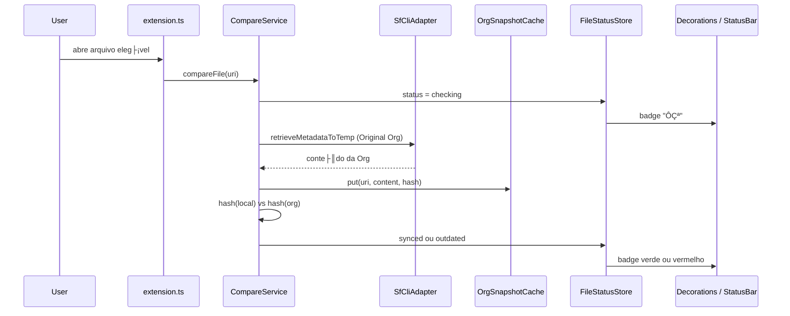

# Salesforce Compare ÔÇö Arquitetura e guia para o time

Documento interno para quem for continuar o desenvolvimento da extensão **Salesforce Compare** (`LeftConsult.salesforce-compare`).

Versão documentada: **0.2.0**. Código-fonte em TypeScript em `src/`. Ponto de entrada: `src/extension.ts`.

---

## 1. O que ├® esta extens├úo

Extensão para **VS Code** e **Cursor** que compara arquivos-fonte de um projeto Salesforce DX **locais** com o conteúdo da Org autenticada.

Comportamento central:

- Ao abrir um arquivo elegível, a extensão faz **retrieve** da Org em background e compara com o conteúdo local.
- Mostra badges no Explorer / abas: verde (igual), vermelho (diferente), `` (comparando), `!` (erro).
- Status bar: `SF Equal` / `SF Different` / `SF Comparing` / `SF Error`.
- Diff estilo Git (lado a lado) contra a **Original Org** ou contra uma **Org de comparação**.
- **Nunca faz deploy.** S├│ retrieve, cache, hash e UI.

Marketplace:

- VS Code: `LeftConsult.salesforce-compare`
- Cursor (Open VSX): `LeftConsult/salesforce-compare`

---

## 2. Princípios que não podem ser quebrados

Quem evoluir o c├│digo precisa preservar estes invariantes:

1. **Retrieve-only.** O ├║nico m├│dulo que executa `sf` ├® `SfCliAdapter`. Ele n├úo pode ganhar comandos de deploy/push.
2. **Original Org vs Comparison Org.** Badges, status bar e auto-check refletem **somente** Local Ôåö Original Org. Orgs extras existem s├│ para **Diff with Other Org**.
3. **Não poluir o projeto do usuário.** Snapshots da Org e arquivos temporários de comparação ficam no *global storage* da extensão, nunca em `force-app`.
4. **Não alterar o default da CLI.** O fluxo Authorize da extensão **nunca** passa `--set-default`. A Org padrão vem do Salesforce CLI / Extension Pack.
5. **Não cancelar compares ao trocar de arquivo.** A fila em `CompareService` permite jobs em paralelo; abrir outro arquivo enfileira, não aborta.
6. **Auth não abre wizard sozinho.** Falha de autenticação pinta a Org de vermelho na sidebar; o usuário reconecta manualmente.

---

## 3. Stack e ciclo de build

| Peça | Escolha |
|------|---------|
| Runtime | VS Code Extension API (`engines.vscode`: `^1.85.0`) |
| Linguagem | TypeScript 5.6, `strict`, CommonJS, target ES2022 |
| Bundle | **esbuild** (`esbuild.js`)  `dist/extension.js` |
| Empacote | `@vscode/vsce`  `.vsix` |
| Depend├¬ncias de runtime | **Nenhuma.** S├│ `devDependencies`. `vscode` ├® `external` no bundle |

Scripts (`package.json`):

```bash
npm install
npm run watch      # esbuild em watch (desenvolvimento)
npm run compile    # tsc --noEmit (typecheck)
npm run build      # bundle de produção
npm run package    # gera o .vsix
```

Debug: **F5** usa `.vscode/launch.json` (`Run Salesforce Compare Extension`), que dispara `npm: build` e abre um Extension Development Host.

Ativação: `workspaceContains:**/sfdx-project.json`. A extensão **não** liga em workspaces que não são Salesforce DX.

---

## 4. Estrutura de pastas

```
src/
Ôö£ÔöÇÔöÇ extension.ts                 # Composition root (activate / deactivate)
Ôö£ÔöÇÔöÇ commands/                    # Handlers finos de comandos (UI + orquestra├º├úo)
Ôöé   Ôö£ÔöÇÔöÇ diffWithOrg.ts
Ôöé   Ôö£ÔöÇÔöÇ diffWithOtherOrg.ts
Ôöé   Ôö£ÔöÇÔöÇ recheckFile.ts
Ôöé   ÔööÔöÇÔöÇ showLastCheck.ts
Ôö£ÔöÇÔöÇ services/                    # Regras de neg├│cio (sem spawn de CLI)
Ôöé   Ôö£ÔöÇÔöÇ CompareService.ts        # Fila + retrieve + hash + status (Original)
Ôöé   Ôö£ÔöÇÔöÇ OrgResolver.ts           # Resolve a Original Org
Ôöé   Ôö£ÔöÇÔöÇ OrgConnectionService.ts  # Authorize / reconnect / comparison Orgs
Ôöé   Ôö£ÔöÇÔöÇ ConnectedOrgsStore.ts    # Persist├¬ncia workspace das Orgs extras
Ôöé   Ôö£ÔöÇÔöÇ OrgAuthStatusStore.ts    # Sa├║de de auth (vermelho na sidebar)
Ôöé   Ôö£ÔöÇÔöÇ FileStatusStore.ts       # Status synced/outdated por arquivo
Ôöé   Ôö£ÔöÇÔöÇ ComparisonTempFileService.ts
Ôöé   ÔööÔöÇÔöÇ DeployWatcher.ts         # Detecta deploy/retrieve externos
Ôö£ÔöÇÔöÇ infrastructure/              # I/O (CLI, disco, hash)
Ôöé   Ôö£ÔöÇÔöÇ SfCliAdapter.ts          # ├ÜNICO lugar que chama `sf`
Ôöé   Ôö£ÔöÇÔöÇ OrgSnapshotCache.ts
Ôöé   ÔööÔöÇÔöÇ ContentHashUtil.ts
Ôö£ÔöÇÔöÇ providers/                   # VS Code providers (conte├║do virtual + decora├º├Áes)
Ôöé   Ôö£ÔöÇÔöÇ OrgContentProvider.ts
Ôöé   Ôö£ÔöÇÔöÇ StatusDecorationProvider.ts
Ôöé   Ôö£ÔöÇÔöÇ ComparisonFileDecorationProvider.ts
Ôöé   ÔööÔöÇÔöÇ OrgSidebarDecorationProvider.ts
Ôö£ÔöÇÔöÇ ui/
Ôöé   Ôö£ÔöÇÔöÇ StatusBarController.ts
Ôöé   ÔööÔöÇÔöÇ ConnectedOrgsTreeProvider.ts
ÔööÔöÇÔöÇ util/
    Ôö£ÔöÇÔöÇ constants.ts             # IDs de comando, schemes, contextos
    Ôö£ÔöÇÔöÇ SalesforcePathMapper.ts  # Elegibilidade + raiz DX
    Ôö£ÔöÇÔöÇ authErrors.ts
    ÔööÔöÇÔöÇ retrieveWithAuthRetry.ts

document/                        # Hist├│rico de demandas (SALEXT-0001 ÔǪ)
scripts/                         # Publicação Marketplace / Open VSX
images/                          # Ícone da loja + ícone da Activity Bar
```

Camadas (dependências apontam para baixo):

```
extension.ts (wiring)
     commands / ui / providers
         services
             infrastructure / util
```

Não inverter isso: um `SfCliAdapter` não deve conhecer TreeView; um command não deve chamar `execFile` direto.

---

## 5. Composition root (`activate`)

Tudo nasce em `src/extension.ts`. Ordem importante:

1. Infra: `SfCliAdapter`, `OrgResolver`, `FileStatusStore`, `OrgSnapshotCache`.
2. N├║cleo: `CompareService`, `OrgContentProvider`, `StatusDecorationProvider`, `StatusBarController`, `DeployWatcher`.
3. Multi-Org (SALEXT-0004): `ConnectedOrgsStore`, `OrgAuthStatusStore`, `OrgConnectionService`, sidebar, temp files, decora├º├Áes extras.
4. Registrar providers, TreeView, comandos e listeners (`onDidOpen`, `onDidSave`, etc.).
5. `connectedOrgsTree.initialize()` **depois** de registrar o TreeDataProvider (primeiro paint correto).
6. Auto-check dos documentos já abertos.

`deactivate()` s├│ limpa timers de sync externo.

Novos serviços: instanciar aqui, `push` em `context.subscriptions` se forem `Disposable`, e injetar nos commands. Não criar singletons globais.

---

## 6. Mapa dos m├│dulos

### 6.1 Infrastructure

**`SfCliAdapter`** ÔÇö ├║nico ponto que spawna processos:

| M├®todo | CLI | Para qu├¬ |
|--------|-----|----------|
| `isCliAvailable` | `sf version --json` | Detectar `sf` no PATH |
| `getTargetOrg` | `sf config get target-org --json` | Fallback da Original Org |
| `retrieveMetadataToTemp` | `sf project retrieve start --source-dir ÔǪ --ignore-conflicts --json` | Conte├║do da Org **sem** alterar o workspace |
| `listOrgs` | `sf org list --skip-connection-status --json` | Lista rápida (não pinga a Org) |
| `loginOrgWeb` | `sf org login web --alias --instance-url --json` | OAuth no browser |

Retrieve isolado (ideia-chave):

1. Cria pasta temp `sf-compare-proj-*`.
2. Copia s├│ `sfdx-project.json` + o arquivo (e `-meta.xml` companheiro, se existir).
3. Roda retrieve com `--source-dir` relativo e `--ignore-conflicts` (sandbox/scratch não estouram `SourceConflictError`).
4. Lê o arquivo recuperado.
5. Apaga o temp project.

Windows: tenta `sf.cmd` com `shell: true`, depois `sf`. Erros de CLI s├úo limpos (`formatCliFailure`) ÔÇö banners de update e JSON `name`/`message`.

**`OrgSnapshotCache`** ÔÇö snapshots em `globalStorage/org-snapshots`. Chave padr├úo = URI do arquivo (Original Org). Com `scopeByOrg: true`, chave = `uri::org=alias` (diffs de outras Orgs, sem sobrescrever o snapshot da Original).

**`ContentHashUtil`** ÔÇö SHA-256 ap├│s normalizar BOM e CRLF ÔåÆ LF. Local vs Org n├úo deve falhar s├│ por quebra de linha.

### 6.2 Services

**`CompareService`** ÔÇö orquestrador.

- Fila com concorrência `salesforceCompare.maxConcurrentCompares` (default 2).
- Mesmo URI compartilhado: vários waiters, um job (salvo `force: true`).
- `compareFile`  retrieve Original  cache  hash  `synced` / `outdated`.
- `ensureOrgContent` ÔÇö snapshot fresco para Diff with Org (sem wizard inline).
- `ensureOrgContentForOrg` ÔÇö retrieve de Org espec├¡fica **sem** mudar badges.
- `markFromLocalSave` ÔÇö save local vs ├║ltimo hash (sem retrieve).
- `syncLocalWithOrgSnapshot` ÔÇö ap├│s deploy/retrieve externo, trata o local como igual ├á Org.

**`OrgResolver`** ÔÇö Original Org, nesta ordem:

1. Setting `salesforceCompare.targetOrg`
2. Settings do Salesforce Extension Pack (`salesforcedx-vscode-core`)
3. `sf config get target-org`
4. Comando `sf.org.get.default.username` (timeout 1,5 s ÔÇö n├úo pode travar a sidebar)

**`OrgConnectionService`** ÔÇö Authorize (Production / Sandbox / Custom URL / wizard do Extension Pack), reconnect, disconnect, listar Orgs na sidebar. Comparison Orgs entram no store **pelo alias informado**, sem esperar `sf org list`. Username ├® enriquecido em background.

**`ConnectedOrgsStore`** ÔÇö `workspaceState` chave `salesforceCompare.comparisonOrgs`. Por workspace, n├úo global.

**`FileStatusStore`** ÔÇö mem├│ria: `synced | outdated | checking | error | unknown`. Emite `onDidChange` para badges e status bar.

**`OrgAuthStatusStore`** ÔÇö mem├│ria: Org com erro de auth ÔåÆ label vermelha at├® Reconnect.

**`DeployWatcher`** ÔÇö **n├úo** dispara deploy. S├│ observa:

- Fim de comando no terminal (`project deploy` / `project retrieve` / equivalentes sfdx)
- Artefatos `.sf` / `deploy-result.json`
- Tasks VS Code
- IDs conhecidos do Extension Pack (`SF_DEPLOY_COMMANDS` / `SF_RETRIEVE_COMMANDS`)
- Mudança em disco de arquivos elegíveis

Sucesso  `syncOpenEligibleFilesWithOrg()` (marca igual, sem novo retrieve).

**`ComparisonTempFileService`** ÔÇö arquivo temp `Nome.LOCAL_x_ALIAS.ext` em `globalStorage/comparison-org-temps` para o lado direito do diff com outra Org. Decora├º├úo azul.

### 6.3 Commands

Handlers em `src/commands/` devem permanecer **finos**: validar URI, Progress, chamar service, abrir `vscode.diff`.

| Comando | Função |
|---------|--------|
| `salesforceCompare.diffWithOrg` | Retrieve Original + `vscode.diff` (virtual `salesforce-compare:` Ôåö local) |
| `salesforceCompare.diffWithOtherOrg` | QuickPick Org extra + temp file + diff Local Ôåö temp |
| `salesforceCompare.recheckFile` | Compare forçado da Original |
| `salesforceCompare.showLastCheck` | Toast Equal/Different + Diff/Recheck |
| `salesforceCompare.clearCache` | Limpa snapshots e statuses |
| `salesforceCompare.loginOrg` | Authorize (comparison Org) |
| `salesforceCompare.reconnectOrg` | Reauth de uma Org da sidebar |
| `salesforceCompare.disconnectComparisonOrg` | Remove Org extra (não a Original) |
| `salesforceCompare.refreshConnectedOrgs` | Re-resolve Original + redesenha árvore |

H├í aliases `*.context` para o menu de contexto com t├¡tulo `SFCOMP: ÔǪ` (escondidos da Command Palette via `"when": "false"`).

Auth em diffs/recheck passa por `runRetrieveWithAuthRetry`: Progress fecha **antes** do toast de erro; auth failure s├│ marca a sidebar.

### 6.4 Providers e UI

| Classe | Papel |
|--------|--------|
| `OrgContentProvider` | Scheme `salesforce-compare:` ÔÇö conte├║do virtual da Original no diff |
| `StatusDecorationProvider` | Badge verde/vermelho/``/`!` no Explorer e abas |
| `ComparisonFileDecorationProvider` | Azul + `Ôçä` nos temps de comparison Org |
| `OrgSidebarDecorationProvider` | Vermelho na sidebar (`salesforce-compare-org:`) |
| `StatusBarController` | Texto curto + cores de severidade; clique  Show Compare Result |
| `ConnectedOrgsTreeProvider` | Activity Bar **Salesforce Compare  Connected Orgs** |

Cores customizadas em `package.json`  `contributes.colors` (`salesforceCompare.synced`, `.outdated`, `.comparisonOrg`, `.orgAuthError`, ).

---

## 7. Fluxos principais

### 7.1 Auto-check ao abrir arquivo



Abrir outro arquivo **não** cancela o job anterior. `pumpQueue` respeita o limite de concorrência.

### 7.2 Save local

`onDidSaveTextDocument`  `markFromLocalSave`:

- Sem snapshot ainda  `outdated` (Org not checked yet).
- Hash local == hash do snapshot  `synced`.
- Sen├úo ÔåÆ `outdated` (sem novo retrieve).

`onWillSave` marca o URI em `userSaveInProgress` para o sync externo (retrieve do Extension Pack) não competir com o save do usuário.

### 7.3 Diff with Org (Original)

1. `ensureOrgContent` (force retrieve).
2. `OrgContentProvider.notifyChanged`.
3. `vscode.diff(orgUri, localUri, "FILE ÔÇö LOCAL x ALIAS")`.

O lado Org ├® **virtual** (`salesforce-compare:`), n├úo um arquivo no disco do projeto.

### 7.4 Diff with Other Org

1. QuickPick das comparison Orgs (workspace).
2. `ensureOrgContentForOrg(uri, alias)` ÔÇö cache **scoped by org**.
3. Temp `File.LOCAL_x_ALIAS.ext` (fora do projeto, label azul).
4. `vscode.diff(local, temp, "FILE ÔÇö LOCAL x ALIAS")`.

Este fluxo **não** altera Equal/Different da Original.

### 7.5 Resolução da Original Org

```
salesforceCompare.targetOrg
        Ôåô vazio
settings salesforcedx-vscode-core (defaultusername / target-org)
        Ôåô vazio
sf config get target-org
        Ôåô vazio
sf.org.get.default.username (timeout 1.5s)
```

Workspace aberto na pasta-pai do DX: `SalesforcePathMapper.findSalesforceProjectRoot` sobe at├® achar `sfdx-project.json` e, se o start for um diret├│rio, tamb├®m olha **filhos imediatos**.

### 7.6 Authorize an Org

Disponível na sidebar **somente** se já existe Original Org (`salesforceCompare.hasOriginalOrg`).

Fluxo: tipo de login ÔåÆ alias obrigat├│rio ÔåÆ `sf org login web` **sem** `--set-default` ÔåÆ grava no `ConnectedOrgsStore` na hora.

Reconnect: mesmo wizard; limpa `OrgAuthStatusStore` (alias + username).

Disconnect: só comparison Orgs. Original não sai da lista por este comando.

---

## 8. Arquivos elegíveis

`SalesforcePathMapper.isEligibleFile`:

1. Scheme `file`.
2. Extensão em `salesforceCompare.supportedExtensions` (default: `.cls`, `.trigger`, `.js`, `.html`, `.css`, `.xml`, `.page`, `.component`, `.apex`, `.soql`).
3. Path com `force-app` ou `main/default`.
4. `.js` / `.html` / `.css` s├│ sob `lwc/` ou `aura/`.
5. **N├úo** compara companions (`MyClass.cls-meta.xml`, `*.js-meta.xml`, Aura companions). Compara o fonte principal. XML **standalone** (`*.object-meta.xml`, layouts, flows, permission sets, etc.) **├®** eleg├¡vel.

Context key `salesforceCompare.isEligible` alimenta menus do editor/explorer e a Command Palette.

---

## 9. Status interno vs UI

| UI | Status | Significado |
|----|--------|-------------|
| Equal to Org / `SF Equal` | `synced` | Local == ├║ltimo snapshot da Original |
| Different from Org / `SF Different` | `outdated` | Local Ôëá snapshot |
| Comparing / `SF Comparing` | `checking` | Retrieve em andamento ou na fila |
| Compare failed / `SF Error` | `error` | CLI / auth / projeto DX não encontrado |

---

## 10. Manifesto (`package.json`) ÔÇö o que mexer com cuidado

- **Commands, menus, views, settings, colors** vivem aqui. Novo comando: declarar em `contributes.commands` + constante em `src/util/constants.ts` + `registerCommand` em `extension.ts`.
- **when clauses:**
  - `salesforceCompare.isEligible` ÔÇö arquivo atual pode ser comparado
  - `salesforceCompare.hasComparisonOrgs` ÔÇö mostra Diff with Other Org
  - `salesforceCompare.hasOriginalOrg` ÔÇö mostra bot├úo Authorize na sidebar
- **viewItem** da árvore: `salesforceCompare.originalOrg` vs `salesforceCompare.comparisonOrg` (e `*Error`). Disconnect só no comparison.
- Settings: `enabled`, `autoCheckOnOpen`, `targetOrg`, `supportedExtensions`, `maxConcurrentCompares`.

---

## 11. Como desenvolver daqui para frente

### Ambiente

1. Salesforce CLI (`sf`) no PATH.
2. Pasta com `sfdx-project.json` e Org autenticada (Extension Pack recomendado).
3. `npm install` + `npm run watch` **ou** F5 (build + Extension Host).

Testar sempre num **projeto DX real**, não só neste repositório da extensão.

### Adicionar um comando

1. ID em `COMMANDS` (`constants.ts`).
2. Entrada em `package.json` (`commands` + `menus` se for contexto).
3. Função em `src/commands/` (DocString; comentários em inglês).
4. Registrar em `activate` com as dependências já criadas.
5. Se a demanda tiver ticket: blocos `//SALEXT-XXXX - start` / `//SALEXT-XXXX - end`.

### Adicionar um tipo de metadata

Ajustar `isEligibleFile` / `COMPANION_META_SUFFIXES` / `supportedExtensions`. O retrieve usa `--source-dir` no path relativo ao `sfdx-project.json`; tipos que a CLI n├úo resolve assim precisam de estrat├®gia nova **no adapter**, n├úo espalhada nos commands.

### Mexer em retrieve / org list / login

S├│ em `SfCliAdapter`. Manter `--json`, limpeza de banners e `--ignore-conflicts` no retrieve isolado.

### UI de status

N├úo duplicar l├│gica de label: `CompareService.formatCompareResultLabel` ├® a fonte. Status bar e toast consomem isso.

### Persistência

| Dado | Onde | Escopo |
|------|------|--------|
| Snapshots Original / scoped | `globalStorage/org-snapshots` | Máquina / usuário VS Code |
| Temps comparison Org | `globalStorage/comparison-org-temps` | Máquina |
| Lista de comparison Orgs | `workspaceState` | **Por workspace** |
| Status de arquivo / auth error | Mem├│ria | Some ao recarregar a janela |

---

## 12. Conven├º├Áes do reposit├│rio

- Coment├írios, nomes de m├®todos/vari├íveis e DocStrings no c├│digo: **ingl├¬s**.
- Fun├º├Áes p├║blicas: DocString (`@param`, `@returns`, `@throws`).
- Clean Code / SOLID: uma responsabilidade por classe; commands sem I/O de CLI.
- Demandas Salesforce-style: `//AEV-XXXX` / `//SALEXT-XXXX - start/end` nas altera├º├Áes.
- Hist├│rico de demandas em `document/SALEXT-XXXX/` (resume + c├│pias compare).
- Changelog: `CHANGELOG.md` (Keep a Changelog). Bump de `version` em `package.json` junto.

Demandas já feitas neste repo (contexto):

- **SALEXT-0001** ÔÇö base (compare, badges, diff Original)
- **SALEXT-0002** ÔÇö publica├º├úo Marketplace
- **SALEXT-0003** ÔÇö XML standalone, fila background, UX Equal/Different
- **SALEXT-0004** ÔÇö multi-Org, sidebar, Diff with Other Org, Authorize

---

## 13. Publicação

Guias: `document/PUBLISH_MARKETPLACE.md` e scripts em `scripts/`.

```bash
# bump version + CHANGELOG primeiro
npm run publish:marketplace   # Visual Studio Marketplace
npm run publish:openvsx       # Cursor / Open VSX
npm run publish:all
```

Cursor **não** usa o Marketplace da Microsoft; precisa Open VSX.

---

## 14. Lacunas e cuidados para o pr├│ximo desenvolvedor

- **Não há suíte de testes automatizados** (`*.test.ts`). Prioridade: `SalesforcePathMapper`, `ContentHashUtil`, `isAuthenticationError`, fila do `CompareService` (com CLI mockado).
- `OrgSnapshotCache` ├® ├¡ndice **em mem├│ria**; recarregar a janela perde o ├¡ndice (arquivos no disco podem sobrar). Clear Cache recria a pasta.
- `listOrgs` usa `--skip-connection-status` de prop├│sito (sen├úo a sidebar trava). N├úo ÔÇ£melhorarÔÇØ isso sem um timeout/cache.
- `DeployWatcher` ├® heur├¡stico (terminal, artifacts, command IDs). Novos IDs do Extension Pack entram em `constants.ts`.
- Diff Original usa URI virtual; Diff Other Org usa arquivo temp real (VS Code diferencia melhor o lado azul). Não unificar sem validar UX de abas.
- `getRelativeSourcePath` est├í **deprecated** ÔÇö usar `resolveProjectContext`.

---

## 15. Checklist rápido antes de um PR

- [ ] A extensão ainda **não** faz deploy
- [ ] Badges/auto-check ainda são só Original Org
- [ ] Comparison Orgs não mudam `target-org` da CLI
- [ ] Retrieve continua em projeto temp + `--ignore-conflicts`
- [ ] Arquivos novos têm DocString; comentários em inglês
- [ ] `npm run compile` passa
- [ ] Testar no Extension Host: open file, save, Diff with Org, Diff with Other Org, Authorize, Reconnect, deploy via CLI e ver badge verde
- [ ] `CHANGELOG.md` + versão se for release

---

## 16. Referência rápida de arquivos

| Quer mudar | Comece em |
|-------------|-----------|
| Ligar serviços / listeners | `src/extension.ts` |
| Fila, compare, badges de sync | `src/services/CompareService.ts` |
| Chamadas `sf` | `src/infrastructure/SfCliAdapter.ts` |
| Quem ├® a Original Org | `src/services/OrgResolver.ts` |
| Login / sidebar Orgs | `src/services/OrgConnectionService.ts` |
| Elegibilidade de path | `src/util/SalesforcePathMapper.ts` |
| Manifesto / menus / settings | `package.json` |
| IDs e context keys | `src/util/constants.ts` |
| Bundle | `esbuild.js` |
